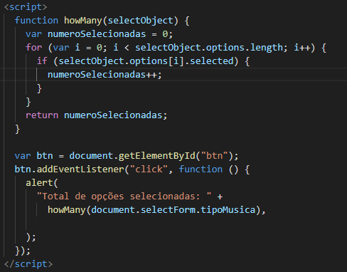
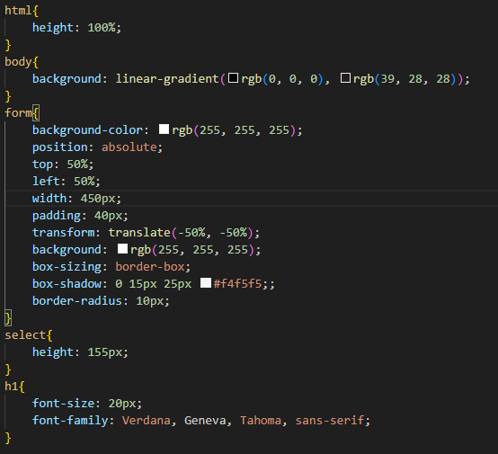

# Objetivo
 Implementar três novos estilos musicais no programa JavaScript

# Tecnologias utilizadas
* GitHub
* developer mozilla
* VScode

# HTML

# JavaScript

## Função howMany(selectObject):

Função howMany(selectObject):

* Esta função é responsável por contar quantas opções foram selecionadas no campo de seleção múltipla.

* Recebe um parâmetro selectObject, que representa o objeto do campo de seleção múltipla.

* Inicializa uma variável numeroSelecionadas para contar o número de opções selecionadas.

* Usa um loop for para iterar sobre todas as opções no campo de seleção.

* Se uma opção estiver selecionada (selectObject.options[i].selected), incrementa o contador numeroSelecionadas.

* Retorna o número total de opções selecionadas.

## Evento de clique no botão:

* O código atribui uma função anônima ao evento de clique do botão.

* var btn = document.getElementById("btn"); seleciona o botão com o id "btn".

* btn.addEventListener("click", function () { ... }); adiciona um ouvinte de evento de clique ao botão.

* Quando o botão é clicado, a função anônima é executada.

## Dentro da função anônima do evento de clique:

* howMany(document.selectForm.tipoMusica) chama a função howMany, passando o objeto do campo de seleção múltipla como argumento.

* O resultado é o número de opções selecionadas.

* alert("Total de opções selecionadas: " + ...); exibe uma caixa de diálogo com uma mensagem que inclui o número de opções selecionadas.

# CSS

## Autores
Ricardo Siena

## Fontes
 O código JS foi pego do site Mozilla